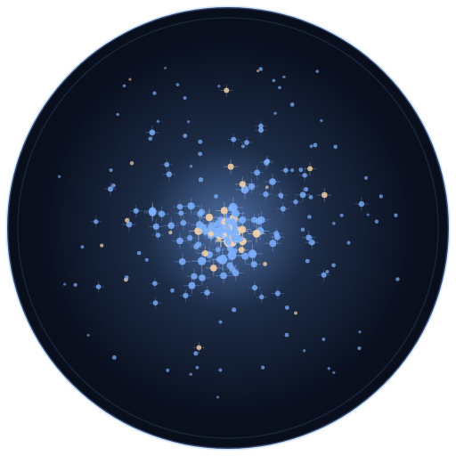

Loads AAVSO extended-format photometry reports into a SQLite database.

The data is Sloan *g* measurements of stars in the globular cluster M15,
observed by Rodney (AAVSO observer code HRHA, VPhot 3.1). Three reports are
included, covering 16,388 measurements of 241 stars between JD 2455478.65 and
JD 2455500.76.

## Layout

| Path | |
|---|---|
| `import_NGC7078_Sloan_SG.py` | the importer |
| `to_import/` | drop new report files here |
| `imported/` | files are moved here once loaded |
| `NGC7078.sqlite` | the database — generated, not in git |
| `branding/` | logo, banner, and the script that draws them |
| `HANDOVER.md` | note describing the conversion and what to watch for |
| `.venv/` | virtual environment — created by you, not in git |

## Setup

```sh
python -m venv .venv
.venv\Scripts\activate          # Windows
source .venv/bin/activate       # Mac / Linux
```

No packages to install. The script uses only the standard library (`sqlite3`,
`csv`, `argparse`, `pathlib`), so there is no `requirements.txt`.

## Running it

```sh
python import_NGC7078_Sloan_SG.py
```

Every file in `to_import/` that is not already in `imported/` gets loaded, then
moved to `imported/`. Output reports how many rows were inserted, how many
updated existing rows, and how many lines could not be parsed.

Options:

| Flag | |
|---|---|
| `--keep` | leave files in `to_import/` instead of moving them |
| `--project-path PATH` | use a different folder for `to_import/`, `imported/` and the database (defaults to the script's folder) |

## How the data is stored

Everything goes into one table, `Sloan_SG`, with the 15 columns of the AAVSO
extended format: `STARNAME`, `DATE`, `MAG`, `MERR`, `FILT`, `TRANS`, `MTYPE`,
`CNAME`, `CMAG`, `KNAME`, `KMAG`, `AMASS`, `GROUP`, `CHART`, `NOTES`. `DATE` is
a Julian date. Numeric columns are stored as `REAL`; AAVSO `NA` placeholders
become `NULL`.

A unique index on `(STARNAME, DATE, FILT)` is the natural key: one star, at one
Julian date, in one filter. Re-importing a file cannot duplicate rows.

Loading a row whose key already exists **overwrites** the other columns rather
than skipping it, so a reprocessed stack with better calibration corrects what
is already stored. The consequence is that only the most recently loaded values
survive — the table keeps no history of earlier measurements.

The `#TYPE=EXTENDED` and `#NAME,DATE,...` header lines at the top of each report
are skipped, not treated as errors.

## Branding



`branding/make_branding.py` regenerates the logo and banner from the database.
Each of the 241 dots is one star, sized by its real mean magnitude; the
positions are synthetic, since the AAVSO reports carry no coordinates.

```sh
python branding/make_branding.py
```

That writes the SVGs. The PNGs alongside them were rendered from those with
headless Edge.

## Background

This started as a Python 2.7 script that no longer ran. Rodney's email:

> Hi David,
>
> If you have time, could you ask Claude to convert this 2.7 python to new
> python code?
> These M15 files need to go into the to_import folder, and get loaded into a
> Sqlite3 database

[HANDOVER.md](HANDOVER.md) is the reply: what changed, what was wrong with the
original, and two behaviours worth a second opinion — that a re-import
overwrites, and that no history of earlier magnitudes is kept.
